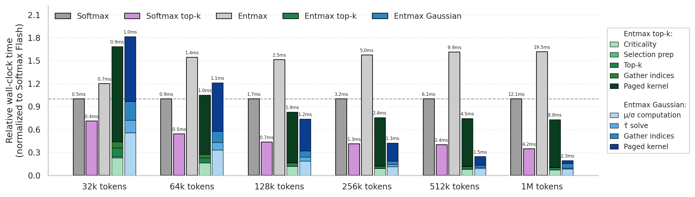

# EntmaxKV

Sparse entmax attention for efficient LLM inference with page-based KV cache selection using page metadata.

During autoregressive decoding, attending over the full KV cache grows expensive as context length increases. EntmaxKV reduces memory movement by selecting the most relevant tokens with two selection strategies: **top-k** page scoring and **Gaussian-aware** distributional selection.

## How it works

Tokens in the KV cache are organized into fixed-size pages (default: 16 tokens). For each decode step, pages are scored by their maximum possible attention contribution, computed from per-page min/max/mean/std key statistics—without touching the actual cached tokens. Only the top pages are attended to.

**Two selection strategies:**

- **Top-k** (`attention_topk.py`): Score pages using a key-range upper bound, select the top-k pages within a token budget. Simple and fast.

- **Gaussian-aware** (`attention_gaussian.py`): Model the distribution of page scores as a Gaussian mixture, solve the distributional entmax constraint analytically to find the attention threshold τ, then select pages with sufficient probability mass above τ. More principled: the number of selected pages adapts to the actual score distribution rather than a fixed budget.


## Installation

```bash
pip install -e .
# optional: scipy for diagnostics
pip install -e ".[diagnostics]"
```

**Requirements**: Python ≥ 3.10, PyTorch ≥ 2.5, Triton ≥ 3.0, CUDA GPU.

## Quick start

```python
import torch
from entmaxkv import PagedKVCache
from entmaxkv.attention_topk import sparse_attention_decode_paged
from entmaxkv.attention_gaussian import sparse_attention_decode_gaussian_aware_entmax

B, H, D = 1, 32, 128
device = "cuda"

# Prefill: build the KV cache
k_prefill = torch.randn(B, H, 1024, D, device=device, dtype=torch.float16)
v_prefill = torch.randn(B, H, 1024, D, device=device, dtype=torch.float16)

cache = PagedKVCache(page_size=16)
cache.initialize(k_prefill, v_prefill)

# Decode step
q      = torch.randn(B, H, 1, D, device=device, dtype=torch.float16)
k_new  = torch.randn(B, H, 1, D, device=device, dtype=torch.float16)
v_new  = torch.randn(B, H, 1, D, device=device, dtype=torch.float16)
out    = torch.empty(B, H, 1, D, device=device, dtype=torch.float16)

cache_seqlens = torch.tensor([1024], device=device, dtype=torch.int32)
q_seqlens     = torch.tensor([1],    device=device, dtype=torch.int32)

# Top-k sparse attention (token_budget controls how many tokens are attended to)
sparse_attention_decode_paged(
    q=q, kv_cache=cache, k_new=k_new, v_new=v_new, out=out,
    token_budget=256, cache_seqlens=cache_seqlens, q_seqlens=q_seqlens,
    alpha=1.5,
)

# Gaussian-aware sparse attention (budget adapts to the score distribution)
sparse_attention_decode_gaussian_aware_entmax(
    q=q, kv_cache=cache, k_new=k_new, v_new=v_new, out=out,
    alpha=1.5, tau_mode="corrected", append_cache=True,
    cache_seqlens=cache_seqlens, q_seqlens=q_seqlens,
)
```


## Repository layout

```
entmaxkv/
├── kv_cache.py                          # PagedKVCache: page management & statistics
├── attention_topk.py                    # Top-k sparse attention
├── attention_gaussian.py                # Gaussian-aware entmax attention
├── tau_solver.py                        # Tau solving (CPU): closed-form + iterative
├── gaussian_utils.py                    # Gaussian statistics & threshold clamping
└── kernels/
    ├── adadecode.py                     # Core decode Triton kernels (dense & paged)
    ├── adadecode_paged.py               # Paged decode variant
    ├── adadecode_paged_gaussian_tau.py  # Paged decode with pre-computed tau
    ├── page_criticality.py              # Page scoring kernel
    ├── gaussian_page_stats.py           # Per-page Gaussian statistics
    ├── selection_pack.py                # Page selection & index packing
    ├── tau_clamp.py                     # Tau clamping to selected pages
    ├── tau_solver_gpu.py                # GPU tau solving (alpha=2, 1.5)
    ├── tau_solver_page_mixture.py       # Tau solving for Gaussian mixtures
    ├── tau_mixture_solver_triton.py     # Triton mixture tau solver (ALiBi)
    └── triton_entmax.py                 # Dense entmax reference implementation
tests/
├── test_topk.py                         # Top-k attention benchmarks
├── test_gaussian.py                     # Gaussian-aware attention benchmarks
└── benchmark_utils.py                   # Reference attention, timing, error metrics
```

## Running tests

```bash
# Top-k sparse attention
python tests/test_topk.py

# Gaussian-aware attention
python tests/test_gaussian.py
```

Benchmarks vary batch size, context length (1K–64K tokens), coverage (25%–50%), alpha, and dtype. They report L2 error, relative error, cosine similarity vs. dense reference attention, and per-iteration latency.


## Efficiency




## Citation

```bibtex
@misc{duarte2026entmaxkvsupportawaredecodingentmax,
      title={EntmaxKV: Support-Aware Decoding for Entmax Attention}, 
      author={Gonçalo Duarte and Miguel Couceiro and Marcos V. Treviso},
      year={2026},
      eprint={2605.21649},
      archivePrefix={arXiv},
      primaryClass={cs.LG},
      url={https://arxiv.org/abs/2605.21649}, 
}
```
